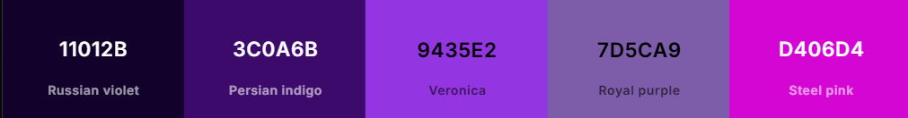

<h1 align="center">
<picture>
  
</picture>
    
Lading Page para Compra de Ingresso

</h1>

 
    <a href="#Sobre">Sobre</a> |
    <a href="#Contato">Contato</a>

 

### Resumo:
Página desenvolvida seguindo o layout disponibilizado pelo cliente  
Lading page básica para arquivos de marketing dos afiliados da plataforma.

### Tecnologias Utilizadas:

  
  
  
  
  

  

### Layout Web:
Page desenvolvida priorizando o [HTML Semântico](index.html) e as
[CSS responsiva](assets/style.css). 
 
 

 
    <a href="https://drmonteze.cupompremium.com/">Clique aqui e veja o resultado</a>
  

  

 
 

### Sobre:

- ### Identidade Visual (Disponibilizada)

  **Logomarca:** Materiais disponibilizados.    
  **Font-Family:** Roboto    

  **Paleta de Cores:** 

    
  

    
  

   

  

    

---

### Contato:

  

  Estou total aberto a conselhos, elogios ou sugestões. **"Todo conhecimento é bem vindo!"**, dar um alô aí!!

   

